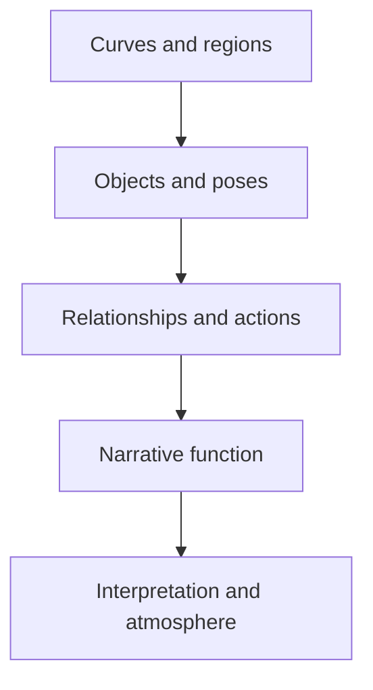

## Addendum: Teaching a Machine to “Feel” the Shape of a Page

Bounded Ink would do more than compress manga. By converting artwork into an ordered mathematical language, it could provide machines with a representation that transformers can study much as they study written text.

A conventional vision model receives a flat array of pixels. It must first discover that those pixels constitute panels, contours, characters, gestures, balloons, and narrative relationships.

Bounded Ink would provide those structures explicitly: 

```text
PANEL_BEGIN
FIGURE character_2
POSE leaning_forward
FACE direction_left
EYES target_character_1
CURVE silhouette [...]
BALLOON speaker_character_2
TEXT "..."
PANEL_END
```

The transformer would not merely see a dark area beside a light area. It would receive a sequence of meaningful geometric events.

### Geometry as language

Each page could be tokenized:

```text
<PAGE>
  <PANEL x=0.04 y=0.03 w=0.46 h=0.42>
    <CHARACTER id=1>
      <POSE id=73>
      <FACE angle=-18>
      <EYES direction=right>
      <CONTOUR curve=...>
    </CHARACTER>
    <BALLOON speaker=1>
      <TEXT>Where are you going?</TEXT>
    </BALLOON>
  </PANEL>
</PAGE>
```

Continuous values such as coordinates, angles, curvature, distance, and line weight could be quantized into geometric tokens or embedded directly as numerical vectors.

The model could learn regularities such as:

* Which curves usually form a face
* How eyes relate to attention
* How posture relates to emotion
* Where balloons appear relative to speakers
* How panel size relates to narrative emphasis
* How dense ink changes atmosphere
* How one panel anticipates the next
* How a character’s appearance remains consistent
* How visual tension develops across a page

In this operational sense, it could learn to “feel” the page’s shape: not human consciousness or emotion, but a deeply trained statistical sensitivity to its structure, balance, rhythm, and probable meaning.

### Learning by prediction

Transformers learn powerful representations by predicting missing or subsequent information. Bounded Ink offers several natural objectives.

#### Next-element prediction

Given:

```text
panel boundary
character silhouette
head orientation
eye direction
```

predict the next likely element:

```text
speech balloon
gesture
background reaction
second character
```

#### Masked-structure reconstruction

Hide part of the page program:

```text
<PANEL>
  <CHARACTER pose=defensive>
  <MISSING>
  <BALLOON type=shout>
</PANEL>
```

The model attempts to reconstruct the missing geometry, expression, action, or annotation.

#### Next-panel prediction

Given the previous panels, predict the likely structural composition of the next one:

```text
wide establishing panel
→ alternating conversation panels
→ close-up reaction
→ silent narrow panel
```

This teaches narrative rhythm rather than isolated image recognition.

#### Work-level consistency

Given earlier appearances of a character, predict their identity and expected visual components in later pages:

```text
hair geometry
+ facial proportions
+ clothing components
+ recurring posture
→ character identity
```

### Simple and advanced annotations

The same geometry could be paired with several levels of annotation.

Simple annotations:

```text
two characters
indoors
conversation
close-up
surprised
looking left
speech balloon
```

Intermediate annotations:

```text
character_1 is addressing character_2
character_2 appears hesitant
the large panel emphasizes character_1
reading order moves upper-right to lower-left
```

Advanced annotations:

```text
The widened spacing between the figures establishes emotional distance.
The following close-up converts verbal tension into silent hesitation.
The black background removes environmental context and concentrates attention
on the character’s reaction.
```

These layers connect physical structure to increasingly abstract interpretation:



The machine could statistically learn that particular arrangements of curves, distances, gazes, panel sizes, dialogue, and black regions frequently correspond to particular relationships or narrative effects.

### Cross-modal alignment

The training record might contain:

```json
{
  "geometry": {
    "panels": [],
    "characters": [],
    "curves": [],
    "regions": []
  },
  "text": {
    "dialogue": [],
    "sound_effects": []
  },
  "annotations": {
    "simple": [],
    "relationships": [],
    "narrative": []
  }
}
```

A transformer could align:

[
Geometry \leftrightarrow Dialogue \leftrightarrow Annotation
]

It might learn, for example, that:

* A face orientation and eye vector identify the intended listener.
* A balloon’s position and tail identify its speaker.
* Repeated close-ups indicate emotional emphasis.
* A sudden increase in black coverage often signals tonal change.
* Panel compression and diagonal motion fields frequently accompany urgency.
* Silence following dense dialogue may carry narrative significance.

### Hierarchical understanding

A manga work exists at several scales:

```text
Curve
→ visual component
→ character or object
→ panel
→ page
→ sequence
→ chapter
→ complete work
```

A hierarchical transformer could operate at each level:

1. A geometry encoder understands curves and regions.
2. A panel encoder understands spatial relationships.
3. A page encoder understands reading order and composition.
4. A sequence encoder understands transitions.
5. A chapter encoder models longer narrative development.

This avoids forcing one model to attend directly to every individual curve across hundreds of pages.

### Why the textual form matters

Because Ink Grammar is serialized, it inherits many advantages of language-model training:

* Elements have explicit order.
* Structures can be masked.
* Pages can be continued.
* Annotations can be interleaved with geometry.
* Tokens can reference earlier characters and components.
* Large datasets can be stored as JSONL or a compact binary equivalent.
* Training examples can be streamed without decoding full-resolution images.
* The same structure supports generation and interpretation.

However, the serialization must preserve two-dimensional relationships. Coordinates, graph connections, containment, and reading order should be encoded explicitly. Plain textual order alone cannot fully represent page geometry.

### From simple lines to completed pages

After learning millions of correspondences between geometric programs and finished artwork, the model could accept:

```text
three panels
character_1 enters from the left
character_2 turns toward character_1
close-up of character_2
final panel contains no dialogue
```

Combined with rough bounded curves:

```text
pose skeletons
face outlines
balloon positions
panel boundaries
```

It could generate a visually coherent page consistent with those constraints.

The human supplies narrative intent and composition. The model supplies learned visual completion.

### A necessary distinction

“Fully understanding” should be used carefully. Training would not prove that the machine experiences a doujin as a human does. It would demonstrate increasingly powerful operational understanding:

* Identifying entities
* Tracking characters
* Resolving speakers
* Inferring relationships
* Recognizing narrative transitions
* Explaining compositional choices
* Predicting missing structure
* Generating coherent continuations

Its apparent feeling for the work would arise from statistical mastery of geometric and narrative regularities.

### Extended claim

> Once manga is translated from pixels into a language of bounded geometry, spatial relationships, dialogue, and annotations, it becomes suitable not merely for image recognition but for transformer-based structural learning.

The machine would learn that a page is not a bag of lines. It is an ordered field of intention: one shape directing attention toward another, one panel altering the meaning of the next, and one repeated outline becoming a recognizable person across time.

Bounded Ink would therefore serve simultaneously as:

* A compression format
* A mathematical manuscript
* A training language
* A structural annotation system
* A page-generation interface
* A foundation for computational interpretation of sequential art
